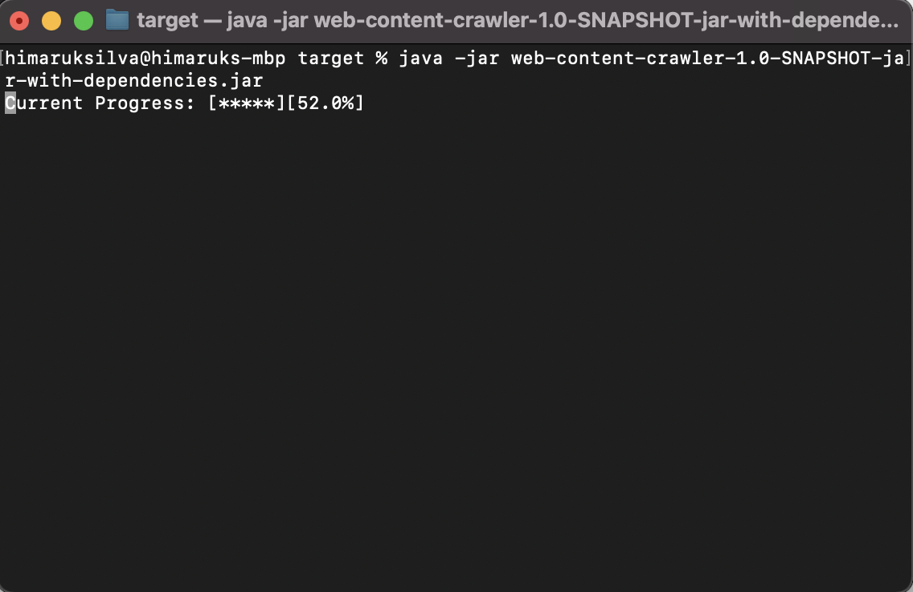

## How to Run the program

- Navigate Go to the "https://github.com/hima1993/websiteCrawler/tree/main/web-content-crawler/target" location.

- Then You will find the jara file called "web-content-crawler-1.0-SNAPSHOT-jar-with-dependencies.jar".

- Then Run the following command "java -jar web-content-crawler-1.0-SNAPSHOT-jar-with-dependencies.jar"

## Output of the program

- When running the program download progress will be showing on the console as illustrates below,

  
  
- When downloading the content those content will be download under the folder called "download_content".

